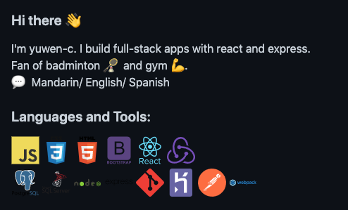

這篇會介紹求職前的準備，包含：寫履歷、履歷刊登平台、Github個人頁面設定、作品介紹、作品集入口網站。

# 履歷要有哪些版本

我原本以為履歷寫一份就好，但後來發現，各個求職平台都會有自己的格式，不一定能用自己準備好的履歷投遞，雖然內容都差不多，但真的得花些時間準備。

## A4萬用版

我是參考這篇文章寫成的：

[How to write an effective developer resume: Advice from a hiring manager](https://stackoverflow.blog/2020/11/25/how-to-write-an-effective-developer-resume-advice-from-a-hiring-manager/)

裡面最大的重點是：放上跟該職缺「相關」的內容，來讓你有機會得到面試。以我自己來說，我沒有相關工作經驗，所以我選擇把作品集放最上面，最後才稍微提到先前的工作經驗。

[我的履歷](https://yuwen-files.netlify.app/Resume_YuWen.pdf)

履歷可以放到netlify上，方便丟連結給人資。

[模板](https://blog.pragmaticengineer.com/the-pragmatic-engineers-resume-template/)也是前面那篇文章的作者提供的。

## Cakeresume

這個求職平台可以展示自己作品，也可以產生圖文並茂的履歷。另外，如先前所說，最重要、最相關的內容往前放，cakeresume也允許使用者調整項目順序，不相關的工作經驗往後放。

**小提醒：作品最好背景不要是白色的，否則螢幕截圖印在履歷上，會看不出邊界，效果不好。**

## Yourator

可以自行調整履歷上的項目順序，但投遞時，無法自行上傳客製化的版本，這點我比較不喜歡，我會另外去找該公司有沒有在其他平台刊登職缺，使用別種管道投遞。

## 104

104前陣子改版了！允許使用者調整順序，也可以上傳作品圖片，只是最後的履歷成品，會強制在履歷最上方顯示上一份工作職稱，對轉行求職者比較不友善一些些。

他們還有免費的履歷健診，可以依照產業別去搜尋，提供對方你的履歷、及自己的需求介紹，對方會提供意見。

# 其它求職、或讓自己曝光的平台

## LinkedIn

建立個人檔案、加聯絡人，這部分可以參考我之前的[從零開始建立LinkedIn個人檔案](/2021-05-build-your-linkedin-profile/)

## Meet.jobs

這邊沒有自己的履歷版面，是用填資料 + 上傳的方式，可以自己上傳客製化pdf，有欄位可以放作品集連結。
他們有時候會辦線上面試，集合多家公司在同一天舉行，可以注意他們的臉書。
另外比較特別的是，如果從這邊求職，並且去上班的話，可以領取祝賀金100美金。

## Teamdoor

這邊只提供給公司應徵使用，使用者不需要註冊帳號、建立履歷，看到有興趣的職缺，直接點應徵，可以選擇自己填寫，或是選擇匯入yourator的資料。

## Appworks

這邊無法投遞，他們是跟yourator合作的，投遞要到yourator。不過這邊可以看到很多[新創公司的介紹](https://appworks.yourator.co/blogs?page=1)，有興趣的人可以參考。

# Github

## 個人頁面設定

### 頭像旁的自我介紹

Edit profile，我是簡單寫上web developer、frontend developer，加上email、地點。

[我的Github頁面](https://github.com/yuwen-c)

### 個人的README.md

這部分可參考[官方文件](https://docs.github.com/en/github/setting-up-and-managing-your-github-profile/customizing-your-profile/managing-your-profile-readme)，加上去之後會在你的github首頁顯示自我介紹。

這邊推薦一個好用的工具 - [github readme generator](https://github.com/rahuldkjain/github-profile-readme-generator)，可以幫你完成一個簡單又好看的自我介紹，並且把會的技術的icon顯示出來，像是這樣：

### pin repo

可以把想展示的repo固定在上面，最多6個。
除了pin，別忘記去編輯該repo的介紹，會顯示在pin的欄位。

## 詳細介紹作品

在README.md詳細介紹你的作品。想像人資、技術主管一天要看多少人的履歷、作品，如何讓他們無痛的了解你做了什麼、有什麼技術，我是抱著這樣的心態做這個。

我的介紹方式及做法是，把project的主要function再重新看過一次(時間久了需要找回記憶)，順出整個邏輯，然後決定分成幾個部分來介紹，例如功能、使用技術(及我為何要使用這個工具)、怎麼做的、前後端怎麼連接，state的改變。

**為何要使用一樣工具，常常是初學者忽略的地方，也是senior工程師在解決問題時會有的思考點。**

另外，為了幫助讀者理解，我還搭配流程圖，流程圖是用[Draw.io](https://app.diagrams.net/)做的。
另外，考量到我的求職地點在中文區，所以我做了中英兩個版本。可以參考：

[Dieta減重app的中文介紹](https://github.com/yuwen-c/dieta/blob/master/README_Mandarin.md)

這真的是一個不小的工程，但過程中我發現，這也等於是一面在幫我準備面試時要如何介紹這個project。

有看過以上範例的人可能會發現我很愛用emoji，我覺得看起來比較活潑，不過這部分就視個人風格選擇囉。

# portfolio，作品集入口網站

用一個網站，整合履歷和作品，我覺得也是不錯的方式。我的portfolio模板是用一位[ZTM](https://zerotomastery.io/)同學的專案 - simplefolio，裡面夾了我的A4萬用履歷，跟各個作品的實際操作連結、github連結。該專案由此去：

[simplefolio](https://github.com/cobidev/simplefolio)

