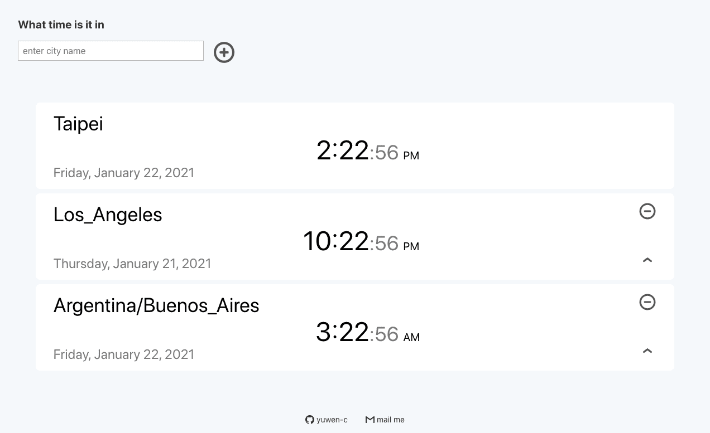

## 什麼時候會用到SVG

在做project的時候，常常需要有些icon來讓使用者操作，最好直覺易理解，例如箭頭、下一頁等等。這種時候用SVG就非常適合，圖案簡單，又可以很容易修改顏色、大小，去符合我們要的格式。

## HOLA SVG

跟大家介紹一個好用的網頁[HOLA SVG](https://holasvg.com/icons/):


我記得去年(2020)中下旬時第一次用它，那時候還沒有這麼多選擇，今年(2021)想要用時回去看，竟然多了好多圖案。

當時我把它應用在我的[worldtime](https://yuwen-worldtime-luxon.netlify.app/)專案裡面，圓形的加號、減號，及一個往上的指數符號。



以加號為例：

```jsx
<svg fill='none' stroke='#0E1A27' stroke-width='8' stroke-dashoffset='0' stroke-dasharray='0' stroke-linecap='round' stroke-linejoin='round' xmlns='http://www.w3.org/2000/svg' viewBox='0 0 100 100'>
	<circle cx="50" cy="50" r="40"/> 
	<line x1="35" y1="50" x2="65" y2="50" /> 
	<line x1="50" y1="35" x2="50" y2="65" />
</svg>
```

稍微觀察一下就可以發現，他的結構就是外面由svg tag包住，裡面有一個圓圈```<circle>```，及兩條直線```<line>```。

我把它用在我的專案裡面：

```jsx
<div className="w-10 ml3">
	<svg className="grow"
   fill='none' stroke='#555555' strokeWidth='10' strokeDashoffset='194' strokeDasharray='0' strokeLinecap='round' strokeLinejoin='round' xmlns='http://www.w3.org/2000/svg' viewBox='0 0 100 100'
   onClick={onPlusButton} >
	<circle cx="50" cy="50" r="40"/> 
	<line x1="35" y1="50" x2="65" y2="50" /> 
	<line x1="50" y1="35" x2="50" y2="65" />
</svg>
</div>
```

**p.s. 因為我用的是react，所以裡面所有的屬性都被改成Camel Case**

```jsx
stroke-width='8'

strokeWidth='10'
```


## 輕鬆客製化

因為code很簡單，我們也可以很容易去客製化，例如從stroke修改顏色，以及stroke-width調整寬度。

不過網站也有一個很棒的功能，在最上面可以調整寬度、顏色、圓角。


大小的部分可以在外面包```<div>```來做調整，非常容易(我設的w-10、ml3、grow是tachyons的設定，要另外安裝套件才能用。)

另外，圖形本身還可以做小小的改造：我需要一個往上移動的icon，我挑了start up符號：

```jsx
<svg fill='none' stroke='#0E1A27' stroke-width='8' stroke-dashoffset='0' stroke-dasharray='0' stroke-linecap='round' stroke-linejoin='round' xmlns='http://www.w3.org/2000/svg' viewBox='0 0 100 100'>
	<line x1="20" y1="80" x2="80" y2="80" />
	<line x1="50" y1="15" x2="50" y2="65" />
	<polyline fill="none" points="30,30 50,15 70,30" />
</svg>
```

可以看出它是由一個＾的幾何圖形```<polyline>```，加上一條直線、一條橫線所組成。

但我希望圖案可以更簡化，於是把兩條直線拿掉，只保留＾往上的筆畫：

```jsx
<div className="w-10 dib fr w2-ns">
	<svg 
	 onClick={() => {onUpButton(tz)}}
	 className="grow"
	 fill='none' stroke='#555555' strokeWidth='10' strokeDashoffset='194' strokeDasharray='0' strokeLinecap='round' strokeLinejoin='round' xmlns='http://www.w3.org/2000/svg' viewBox='0 0 100 100'>
	<polyline fill="none" points="30,30 50,15 70,30" />
	</svg>
</div>
```
## 其他資源

還有一個SVG的資源 - [Font Awesome](https://fontawesome.com/icons?d=gallery&p=2&q=up) 也很不錯，有很多生活化的圖案 ，不過就多了要安裝的步驟。


如果要用的icon數量不多，又是簡單的指令式實用圖形，那很推薦用這個HOLA SVG，作者Mariana Beldi是來自阿根廷的平面設計師、UI/UX工程師，有興趣可以去他個人網站逛逛：

[Hola Belda](https://www.holabelda.com/)